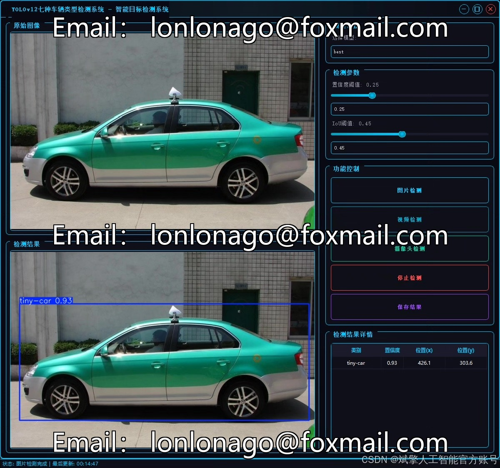
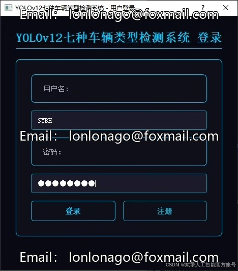
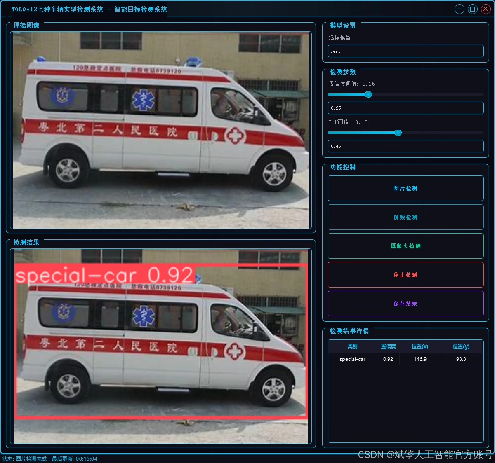
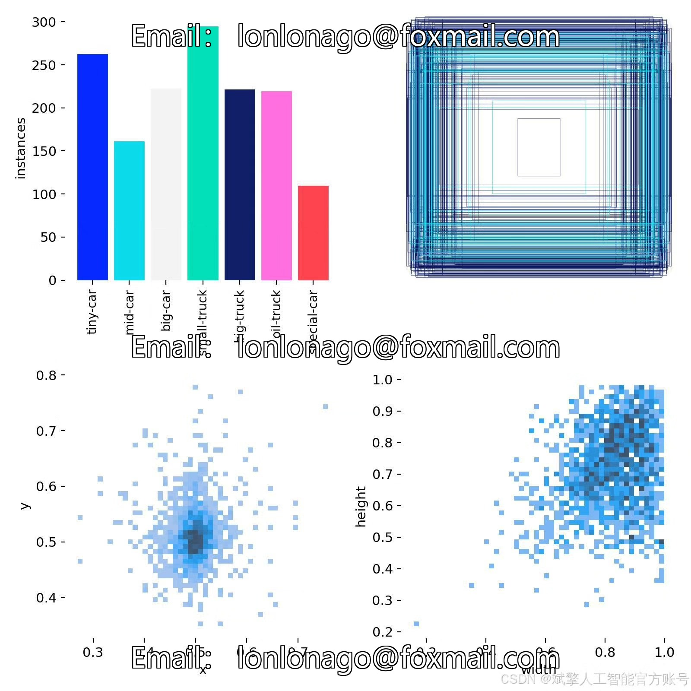
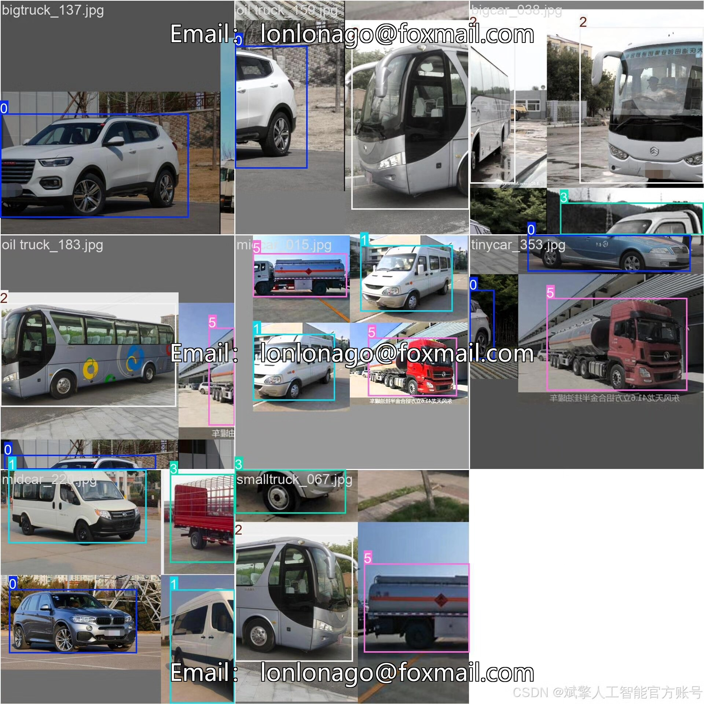
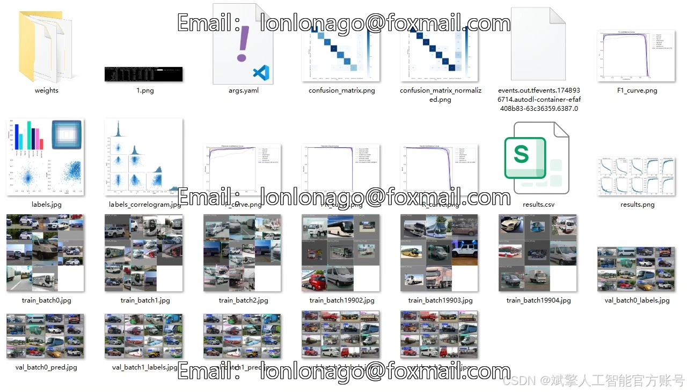
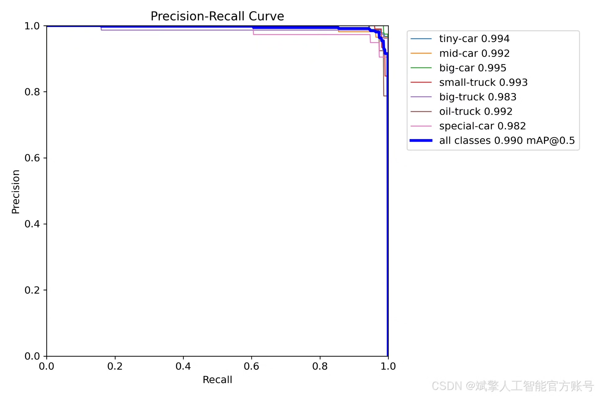
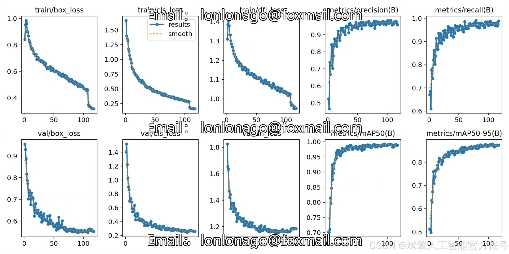
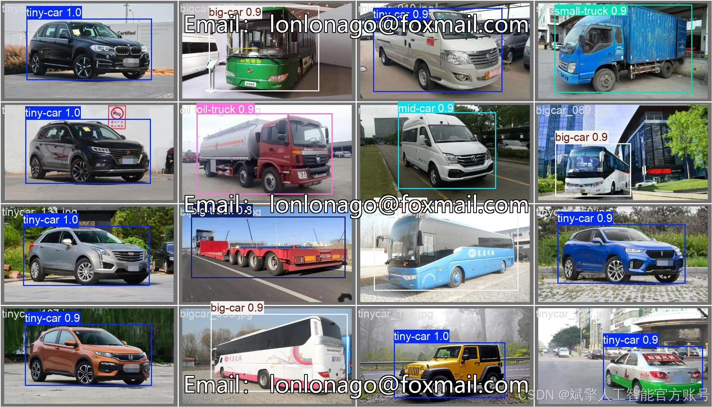

# YOLOv12 vehicle type detection system

## Body

YOLOv12 Vehicle Type Detection System Based on Deep Learning YOLOv12: A System for Efficient Vehicle Type Identification (YOLOv12+YOLO dataset + UI interface + login and registration interface + Python project source code + model)

This paper introduces a vehicle type detection system based on the deep learning YOLOv12 algorithm, which can efficiently identify seven types of vehicles (minivans, medium-sized cars, large trucks, small trucks, large trucks, tankers, and special vehicles). The system combines the real-time detection advantages of YOLOv12 with a user-friendly UI interface, supporting login and registration functions, facilitating multi-user management. The project provides complete Python source code, pre-trained models, and labeled datasets, covering training sets (1488 images), validation sets (507 images), and test sets (31 images), demonstrating high practicality and scalability, suitable for scenarios such as traffic monitoring and intelligent parking lots.

✅ User Login and Registration: Supports password verification and security validation.
✅ Three Detection Modes: Based on the YOLOv12 model, supports image, video, and real-time camera detection, accurately identifying targets.
✅ Dual-Screen Contrast: Displays the original scene and detection results simultaneously on the same screen.
✅ Data Visualization: Real-time table displays the category, confidence, and coordinates of detected targets.
✅ Intelligent Parameter Tuning: Offers a confidence slide bar to dynamically optimize detection accuracy, adapting to different scene requirements.
✅ Sci-Fi Interactive Interface: Dark theme combined with dynamic light effects, reducing visual fatigue and enhancing operational experience.

## Images

## Payment

Here is a pay link on Stripe ( https://buy.stripe.com/3cs8yP7sY87d0vu9AB ). Please contact me lonlonago@foxmail.com after funding $89, and I will send you a complete data files , thank you!

